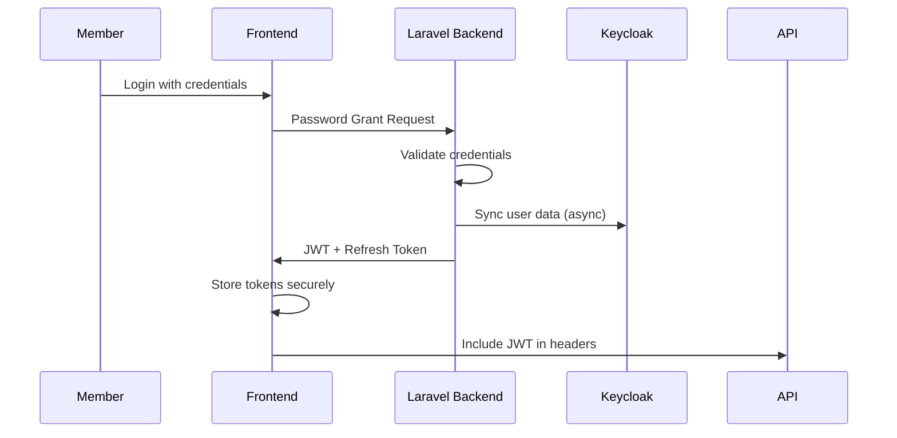
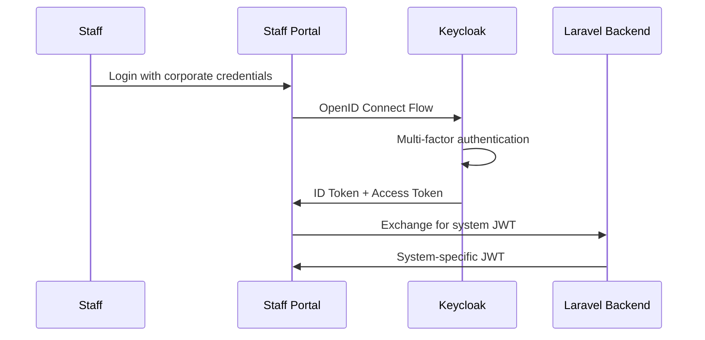

# ADR 0002: Authentication and Authorization Architecture

## Status
Accepted

## Context
The SACCO Management System handles sensitive financial data and requires a robust, secure, and scalable authentication and authorization system. The system must support:

- **Multi-tenancy** with role-based access across member, staff, and board portals
- **Financial-grade security** with strong authentication mechanisms
- **Regulatory compliance** (Data Protection Act, CBK guidelines)
- **Multiple client types** (web, mobile, third-party integrations)
- **Session management** with appropriate timeouts for financial operations
- **Audit trails** for all authentication and authorization events
- **Social login options** for member convenience while maintaining security

## Decision
We will implement a **centralized authentication service** using Laravel Passport for API authentication, complemented by Keycloak for advanced identity management, with a role-based access control (RBAC) system tailored for financial operations.

### Core Authentication Stack

#### 1. Primary Authentication: Laravel Passport
```yaml
Purpose: API authentication for web and mobile clients
Flow: OAuth 2.0 Password Grant for first-party clients
Tokens: JWT with 1-hour expiry, refresh token rotation
Storage: Redis for token blacklisting and session management
```

#### 2. Identity Management: Keycloak
```yaml
Purpose: Centralized identity provider for advanced features
Flow: OpenID Connect for web single sign-on
Features: Social login, multi-factor authentication, identity brokering
Integration: Sync with Laravel user system
```

#### 3. Session Management: Hybrid Approach
```yaml
Web Sessions: Laravel session cookies with CSRF protection
API Sessions: JWT tokens with refresh mechanism
Mobile Sessions: Long-lived tokens with device fingerprinting
```

### Authentication Flows

#### Member Authentication Flow


#### Staff Authentication Flow


### Authorization Model: Role-Based Access Control (RBAC)

#### User Roles Hierarchy
```yaml
System Roles:
  - Super Administrator: Full system access
  - System Administrator: Technical administration
  - Compliance Officer: Regulatory oversight
  - Auditor: Read-only audit access

Business Roles:
  - Board Member: Strategic oversight
  - CEO/Manager: Business operations
  - Loan Officer: Loan processing
  - Teller: Transaction processing
  - Member Service: Member support

Member Roles:
  - Member: Basic account access
  - Premium Member: Enhanced features
  - Guarantor: Loan guarantee capabilities
```

#### Permission Matrix
```yaml
# Financial Transactions
- view_transactions: Member, Teller, Loan Officer+
- create_transactions: Teller, Loan Officer+
- approve_transactions: Loan Officer, Manager+
- reverse_transactions: Manager, Compliance Officer+

# Loan Management
- apply_loans: Member
- view_loans: Member (own), Loan Officer+
- approve_loans: Loan Officer, Manager+
- restructure_loans: Manager, CEO+

# Member Data
- view_member_profile: Member (own), Member Service+
- update_member_profile: Member (own), Member Service+
- view_kyc_documents: Compliance Officer, Loan Officer+
- approve_kyc: Compliance Officer, Manager+

# System Administration
- manage_users: System Administrator+
- view_audit_logs: Auditor, Compliance Officer+
- generate_reports: Manager, Board Member+
- system_configuration: Super Administrator
```

### Technical Implementation

#### Laravel Passport Configuration
```php
// config/auth.php
'guards' => [
    'api' => [
        'driver' => 'passport',
        'provider' => 'users',
    ],
],

// User Model
class User extends Authenticatable
{
    use HasApiTokens;
    
    public function roles()
    {
        return $this->belongsToMany(Role::class);
    }
    
    public function hasPermission($permission)
    {
        return $this->roles()->whereHas('permissions', function($q) use ($permission) {
            $q->where('name', $permission);
        })->exists();
    }
}
```

#### Middleware Stack
```php
// app/Http/Kernel.php
protected $routeMiddleware = [
    'auth' => \App\Http\Middleware\Authenticate::class,
    'auth.api' => \App\Http\Middleware\AuthenticateAPI::class,
    'role' => \App\Http\Middleware\AuthorizeRole::class,
    'permission' => \App\Http\Middleware\AuthorizePermission::class,
    'scope' => \Laravel\Passport\Http\Middleware\CheckScopes::class,
    'scopes' => \Laravel\Passport\Http\Middleware\CheckForAnyScope::class,
];
```

#### Route Protection Examples
```php
// Member routes (basic authentication)
Route::middleware(['auth:api'])->group(function () {
    Route::get('/profile', 'MemberController@profile');
    Route::post('/loans/apply', 'LoanController@apply');
});

// Staff routes (role-based)
Route::middleware(['auth:api', 'role:loan_officer'])->group(function () {
    Route::get('/loans/pending', 'LoanController@pending');
    Route::post('/loans/approve', 'LoanController@approve');
});

// Admin routes (permission-based)
Route::middleware(['auth:api', 'permission:system_configuration'])->group(function () {
    Route::get('/system/config', 'SystemController@config');
    Route::post('/system/config', 'SystemController@updateConfig');
});
```

### Security Measures

#### Password Policies
```yaml
Complexity Requirements:
  - Minimum length: 8 characters
  - Require uppercase, lowercase, numbers
  - Special characters recommended
  - Password history: 5 previous passwords
  - Maximum age: 90 days

Account Protection:
  - Maximum login attempts: 5
  - Lockout duration: 30 minutes
  - Session timeout: 15 minutes inactivity
  - Forced logout on password change
```

#### Multi-Factor Authentication
```yaml
Required For:
  - All staff and admin accounts
  - Members with high-value transactions
  - Password reset operations

Methods:
  - SMS OTP (primary for members)
  - Authenticator apps (TOTP for staff)
  - Email verification (backup method)
  - Biometric (mobile app only)
```

#### Token Security
```yaml
JWT Configuration:
  - Algorithm: RS256 (asymmetric)
  - Expiry: 1 hour (access), 30 days (refresh)
  - Claims: user_id, roles, permissions, branch_id
  - Blacklisting: Redis for immediate revocation

Refresh Token Strategy:
  - Single-use refresh tokens
  - Automatic rotation on use
  - Maximum chain length: 5
  - Full logout revokes all tokens
```

### Audit and Compliance

#### Authentication Logging
```php
// App\Listeners\LogAuthenticationAttempts
class LogAuthenticationAttempts
{
    public function handle(AuthenticationEvent $event)
    {
        AuditLog::create([
            'user_id' => $event->user?->id,
            'action' => $event->action,
            'ip_address' => request()->ip(),
            'user_agent' => request()->userAgent(),
            'success' => $event->success,
            'metadata' => $event->metadata,
        ]);
    }
}
```

#### Compliance Features
```yaml
Data Protection:
  - Consent management for data processing
  - Right to erasure implementation
  - Data access logs for subject access requests

Financial Regulations:
  - Session recording for sensitive operations
  - Dual authorization for high-value transactions
  - Time-stamped audit trails for all actions
```

### Integration Architecture

#### Keycloak Integration
```php
// App\Services\KeycloakService
class KeycloakService
{
    public function syncUser(User $user)
    {
        // Sync user to Keycloak for centralized management
    }
    
    public function validateToken($token)
    {
        // Validate JWT tokens issued by Keycloak
    }
}
```

#### Mobile App Authentication
```typescript
// mobile/src/services/auth.ts
class AuthService {
  async login(credentials: LoginCredentials) {
    const response = await api.post('/oauth/token', {
      grant_type: 'password',
      client_id: MOBILE_CLIENT_ID,
      ...credentials
    });
    
    await SecureStore.setItemAsync('access_token', response.access_token);
    await SecureStore.setItemAsync('refresh_token', response.refresh_token);
  }
  
  async refreshToken() {
    // Automatic token refresh with rotation
  }
}
```

## Consequences

### Positive Outcomes
- **Strong Security**: Financial-grade authentication with proper token management
- **Regulatory Compliance**: Built-in audit trails and access controls meeting Kenyan regulations
- **Scalable Architecture**: Supports thousands of concurrent users across multiple portals
- **Flexible Access Control**: Granular permissions tailored for SACCO operations
- **User Experience**: Social login options while maintaining security standards
- **Operational Control**: Comprehensive session management and monitoring

### Negative Outcomes
- **Implementation Complexity**: Multiple authentication systems require careful integration
- **Performance Overhead**: Token validation and role checks on each request
- **Operational Maintenance**: Certificate management for JWT signing
- **Debugging Complexity**: Distributed authentication across multiple services

### Risks and Mitigations
| Risk | Impact | Probability | Mitigation |
|------|--------|-------------|------------|
| **Token Compromise** | High | Medium | Short token expiry, refresh token rotation, immediate revocation |
| **Role Configuration Errors** | High | Low | Automated testing, role validation, change approval process |
| **Keycloak Integration Failures** | Medium | Medium | Fallback to Laravel auth, health monitoring, automatic failover |
| **Mobile Token Storage Issues** | Medium | Medium | Secure storage APIs, token encryption, device binding |

## Migration Strategy

### Phase 1: Core Authentication (Month 1)
```yaml
Objectives:
  - Laravel Passport implementation
  - Basic role system
  - Member and staff authentication
  - Audit logging

Deliverables:
  ✅ Password grant flow for web/mobile
  ✅ Role-based middleware
  ✅ Authentication audit logs
  ✅ Basic password policies
```

### Phase 2: Advanced Features (Month 2)
```yaml
Objectives:
  - Keycloak integration
  - Multi-factor authentication
  - Social login options
  - Enhanced session management

Deliverables:
  ✅ OpenID Connect integration
  ✅ SMS and TOTP MFA
  ✅ Google/Facebook login for members
  ✅ Advanced token management
```

### Phase 3: Compliance & Optimization (Month 3)
```yaml
Objectives:
  - Regulatory compliance features
  - Performance optimization
  - Security hardening
  - Monitoring and alerting

Deliverables:
  ✅ Data protection compliance
  ✅ Token caching and optimization
  ✅ Security headers and policies
  ✅ Real-time security monitoring
```

## Alternatives Considered

### Alternative 1: Laravel Sanctum Only
**Pros**: Simpler implementation, built-in Laravel ecosystem  
**Cons**: Limited OAuth capabilities, no centralized identity management  
**Decision**: Rejected due to need for advanced features and multi-client support

### Alternative 2: Keycloak Only
**Pros**: Enterprise features, social login, identity brokering  
**Cons**: Heavyweight, learning curve, overkill for basic needs  
**Decision**: Rejected as primary due to complexity, adopted for advanced features

### Alternative 3: AWS Cognito
**Pros**: Managed service, high scalability, AWS integration  
**Cons**: Vendor lock-in, cost at scale, limited customization  
**Decision**: Rejected due to vendor lock-in concerns and cost considerations

## Compliance Requirements

### Kenyan Data Protection Act
```yaml
Authentication Data:
  - Explicit consent for biometric data
  - Secure storage of personal information
  - Right to access authentication logs
  - Data minimization in token claims

Security Measures:
  - Encryption of sensitive data
  - Regular security assessments
  - Breach notification procedures
  - Data retention policies
```

### CBK Banking Standards
```yaml
Access Controls:
  - Segregation of duties enforcement
  - Regular access reviews
  - Immediate revocation on termination
  - Session limits for financial operations

Audit Requirements:
  - Immutable authentication logs
  - Failed attempt monitoring
  - Privilege escalation detection
  - Compliance reporting capabilities
```

## Monitoring and Metrics

### Security Metrics
```yaml
Authentication Metrics:
  - Failed login attempts per hour
  - MFA adoption rates
  - Token refresh success rates
  - Session duration patterns

Security Events:
  - Suspicious login locations
  - Multiple device logins
  - Role permission changes
  - Token reuse attempts
```

### Performance Metrics
```yaml
Response Times:
  - Token generation: < 100ms
  - Token validation: < 50ms
  - Role checks: < 10ms
  - User lookup: < 20ms

System Health:
  - Active sessions count
  - Token blacklist size
  - Keycloak sync latency
  - Database query performance
```

## Implementation Timeline

### Week 1-2: Foundation
- Laravel Passport setup and configuration
- Basic user model and role system
- API authentication middleware
- Token management utilities

### Week 3-4: Core Features
- Role-based access control implementation
- Authentication audit logging
- Password policies and validation
- Mobile app authentication flow

### Week 5-6: Advanced Integration
- Keycloak installation and configuration
- OpenID Connect integration
- Multi-factor authentication setup
- Social login providers

### Week 7-8: Security Hardening
- Security headers implementation
- Rate limiting and brute force protection
- Token security enhancements
- Compliance feature implementation

### Week 9-10: Testing & Deployment
- Comprehensive test coverage
- Performance testing and optimization
- Security penetration testing
- Production deployment and monitoring

## Success Criteria

### Technical Success
- [ ] All authentication endpoints respond in < 200ms
- [ ] Token validation adds < 50ms to request processing
- [ ] System handles 1000+ concurrent authentications
- [ ] Zero security vulnerabilities in authentication flow

### Business Success
- [ ] Member onboarding completion rate > 90%
- [ ] Staff authentication success rate > 99%
- [ ] MFA adoption rate > 80% for eligible users
- [ ] Zero unauthorized access incidents

### Compliance Success
- [ ] All regulatory requirements met
- [ ] Audit trails complete and searchable
- [ ] Data protection principles implemented
- [ ] Security assessments passed

---

## Signed

**RedwoodsKenyan**  
Lead Architect & Developer  
Date: $(date +%Y-%m-%d)

**Approvers:**
- [ ] Security Officer
- [ ] Compliance Officer
- [ ] Product Manager
- [ ] CTO/Technical Lead

---

*This Authentication ADR will be reviewed quarterly and updated based on security threats, regulatory changes, and system evolution. All authentication-related changes must comply with this architecture.*
```
