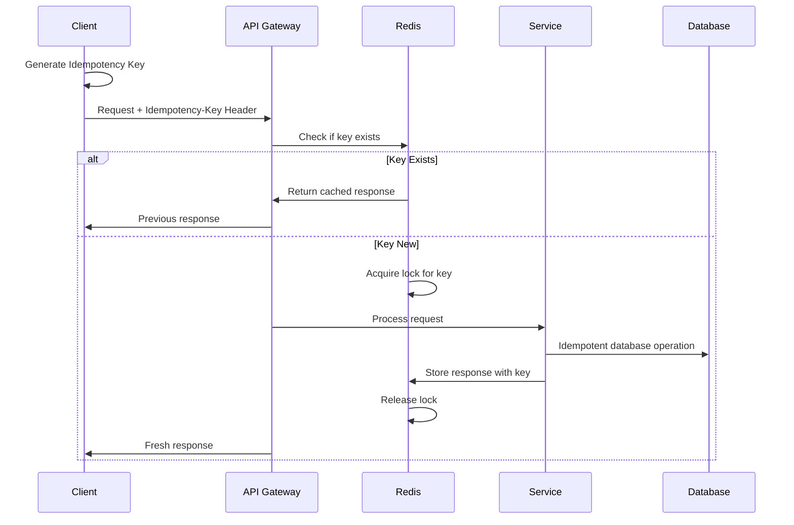

# ADR 0005: Idempotency for Financial Operations

## Status
Accepted

## Context
The SACCO Management System handles critical financial operations where duplicate processing can lead to severe consequences including financial loss, regulatory violations, and member trust erosion. The system must guarantee:

- **Exactly-once processing** for financial transactions
- **Duplicate prevention** across distributed systems
- **Retry safety** for failed operations
- **Network failure resilience** without data corruption
- **Client-side idempotency** for mobile and web applications
- **Cross-service consistency** in microservices architecture
- **Audit trail** for all idempotency operations

## Decision
We will implement a **comprehensive idempotency framework** using idempotency keys, distributed locking, and idempotent storage patterns to ensure exactly-once processing of all financial operations.

### Idempotency Architecture

#### Core Components
```yaml
Idempotency Keys: UUIDv4 generated by clients
Storage: Redis for fast idempotency checks
Persistence: PostgreSQL for audit trails
Locking: Redis distributed locks
Time Window: 24-hour idempotency key validity
```

#### Idempotency Key Flow


### Implementation Patterns

#### Idempotency Key Generation
```typescript
// frontend/shared/lib/idempotency.ts
export class IdempotencyService {
  static generateKey(): string {
    return `idemp_${crypto.randomUUID()}`;
  }

  static async withIdempotency<T>(
    operation: string,
    callback: () => Promise<T>
  ): Promise<T> {
    const idempotencyKey = this.generateKey();
    
    try {
      const response = await fetch('/api/operation', {
        method: 'POST',
        headers: {
          'Idempotency-Key': idempotencyKey,
          'Content-Type': 'application/json',
        },
        body: JSON.stringify({ operation }),
      });

      if (response.status === 409) {
        // Handle duplicate request
        return this.handleDuplicateResponse(response);
      }

      return await response.json();
    } catch (error) {
      // Automatic retry with same key
      return this.retryWithKey(idempotencyKey, callback);
    }
  }
}
```

#### Laravel Middleware Implementation
```php
<?php

// app/Http/Middleware/EnsureIdempotency.php
class EnsureIdempotency
{
    protected $redis;
    
    public function __construct(Redis $redis)
    {
        $this->redis = $redis;
    }
    
    public function handle($request, Closure $next)
    {
        // Only apply to mutating operations
        if (!in_array($request->method(), ['POST', 'PUT', 'PATCH', 'DELETE'])) {
            return $next($request);
        }
        
        $idempotencyKey = $request->header('Idempotency-Key');
        
        if (!$idempotencyKey) {
            return response()->json([
                'error' => 'Idempotency-Key header required'
            ], 400);
        }
        
        // Validate key format
        if (!$this->isValidKey($idempotencyKey)) {
            return response()->json([
                'error' => 'Invalid idempotency key format'
            ], 400);
        }
        
        // Check for existing response
        $cachedResponse = $this->getCachedResponse($idempotencyKey);
        if ($cachedResponse) {
            return response()->json($cachedResponse['data'], 200);
        }
        
        // Acquire distributed lock
        $lock = $this->acquireLock($idempotencyKey);
        if (!$lock) {
            return response()->json([
                'error' => 'Request already in progress'
            ], 409);
        }
        
        try {
            // Process request
            $response = $next($request);
            
            // Cache successful responses
            if ($response->getStatusCode() >= 200 && $response->getStatusCode() < 300) {
                $this->cacheResponse($idempotencyKey, $response);
            }
            
            return $response;
        } finally {
            $this->releaseLock($lock);
        }
    }
    
    protected function isValidKey(string $key): bool
    {
        return preg_match('/^idemp_[a-f0-9-]{36}$/', $key);
    }
    
    protected function acquireLock(string $key): ?string
    {
        $lockKey = "idemp_lock:{$key}";
        $lockValue = Str::random(20);
        
        $acquired = $this->redis->set(
            $lockKey, 
            $lockValue, 
            'NX', 
            'EX', 
            30 // 30 second lock expiry
        );
        
        return $acquired ? $lockValue : null;
    }
    
    protected function cacheResponse(string $key, $response): void
    {
        $cacheData = [
            'data' => json_decode($response->getContent(), true),
            'status_code' => $response->getStatusCode(),
            'headers' => $response->headers->all(),
            'cached_at' => now()->toISOString(),
        ];
        
        $this->redis->setex(
            "idemp_response:{$key}",
            86400, // 24 hours
            json_encode($cacheData)
        );
    }
}
```

### Database-Level Idempotency

#### Idempotent Transaction Processing
```sql
-- accounting.idempotent_transactions
CREATE TABLE accounting.idempotent_transactions (
    idempotency_key VARCHAR(50) PRIMARY KEY,
    transaction_id UUID REFERENCES accounting.transactions(id),
    operation_type VARCHAR(50) NOT NULL,
    request_hash BYTEA NOT NULL, -- SHA256 of request body
    response_data JSONB NOT NULL,
    created_at TIMESTAMPTZ DEFAULT NOW(),
    expires_at TIMESTAMPTZ DEFAULT (NOW() + INTERVAL '24 hours'),
    
    -- Index for cleanup
    CONSTRAINT valid_idempotency_key CHECK (idempotency_key ~ '^idemp_[a-f0-9-]{36}$')
);

CREATE INDEX idx_idempotency_expires ON accounting.idempotent_transactions(expires_at);

-- Unique constraint to prevent duplicates
CREATE UNIQUE INDEX idx_idempotency_operation 
ON accounting.idempotent_transactions(operation_type, request_hash);
```

#### Idempotent Stored Procedures
```sql
-- Idempotent deposit procedure
CREATE OR REPLACE FUNCTION accounting.process_deposit(
    p_idempotency_key VARCHAR(50),
    p_account_id UUID,
    p_amount DECIMAL(15,2),
    p_description TEXT,
    p_payment_method VARCHAR(20)
) RETURNS TABLE(transaction_id UUID, success BOOLEAN, message TEXT) AS $$
DECLARE
    v_existing_record RECORD;
    v_transaction_id UUID;
    v_request_hash BYTEA;
BEGIN
    -- Calculate request hash for idempotency
    v_request_hash = digest(
        p_account_id::text || p_amount::text || p_description || p_payment_method,
        'sha256'
    );
    
    -- Check for existing idempotent operation
    SELECT * INTO v_existing_record
    FROM accounting.idempotent_transactions
    WHERE idempotency_key = p_idempotency_key;
    
    IF FOUND THEN
        -- Return cached response
        transaction_id := v_existing_record.transaction_id;
        success := true;
        message := 'Duplicate request processed idempotently';
        RETURN NEXT;
        RETURN;
    END IF;
    
    -- Check for duplicate operation with same parameters
    SELECT transaction_id INTO v_existing_record
    FROM accounting.idempotent_transactions
    WHERE operation_type = 'deposit' 
    AND request_hash = v_request_hash
    AND created_at > NOW() - INTERVAL '24 hours';
    
    IF FOUND THEN
        -- This is a duplicate request with different idempotency key
        success := false;
        message := 'Duplicate transaction detected';
        RETURN NEXT;
        RETURN;
    END IF;
    
    -- Process the transaction
    INSERT INTO accounting.transactions (
        transaction_reference,
        account_id,
        transaction_type,
        amount,
        description,
        payment_method,
        status
    ) VALUES (
        'DEP' || replace(p_idempotency_key, 'idemp_', ''),
        p_account_id,
        'deposit',
        p_amount,
        p_description,
        p_payment_method,
        'completed'
    ) RETURNING id INTO v_transaction_id;
    
    -- Update account balance
    UPDATE accounting.accounts 
    SET 
        current_balance = current_balance + p_amount,
        available_balance = available_balance + p_amount,
        last_activity_at = NOW()
    WHERE id = p_account_id;
    
    -- Store idempotency record
    INSERT INTO accounting.idempotent_transactions (
        idempotency_key,
        transaction_id,
        operation_type,
        request_hash,
        response_data
    ) VALUES (
        p_idempotency_key,
        v_transaction_id,
        'deposit',
        v_request_hash,
        json_build_object(
            'transaction_id', v_transaction_id,
            'new_balance', (SELECT current_balance FROM accounting.accounts WHERE id = p_account_id)
        )
    );
    
    -- Return success
    transaction_id := v_transaction_id;
    success := true;
    message := 'Deposit processed successfully';
    RETURN NEXT;
    
EXCEPTION
    WHEN unique_violation THEN
        -- Handle race condition
        success := false;
        message := 'Transaction already processed';
        RETURN NEXT;
    WHEN OTHERS THEN
        -- Log error and re-raise
        RAISE;
END;
$$ LANGUAGE plpgsql;
```

### Microservices Idempotency

#### Idempotent Event Processing
```php
<?php

// app/Services/IdempotentEventProcessor.php
class IdempotentEventProcessor
{
    public function processEvent(string $eventId, array $eventData): void
    {
        $lockKey = "event_lock:{$eventId}";
        
        // Acquire lock to prevent concurrent processing
        if (!$this->acquireEventLock($lockKey)) {
            Log::info("Event already being processed", ['event_id' => $eventId]);
            return;
        }
        
        try {
            // Check if event already processed
            if ($this->isEventProcessed($eventId)) {
                Log::info("Event already processed", ['event_id' => $eventId]);
                return;
            }
            
            // Process event (idempotent operation)
            $this->handleEvent($eventData);
            
            // Mark event as processed
            $this->markEventProcessed($eventId);
            
        } finally {
            $this->releaseEventLock($lockKey);
        }
    }
    
    protected function handleEvent(array $eventData): void
    {
        switch ($eventData['type']) {
            case 'member.registered':
                $this->processMemberRegistration($eventData);
                break;
            case 'transaction.completed':
                $this->processTransaction($eventData);
                break;
            case 'loan.disbursed':
                $this->processLoanDisbursement($eventData);
                break;
        }
    }
    
    protected function processTransaction(array $eventData): void
    {
        DB::transaction(function () use ($eventData) {
            // Check if transaction already exists
            $existing = DB::table('accounting.transactions')
                ->where('transaction_reference', $eventData['reference'])
                ->first();
                
            if ($existing) {
                return; // Idempotent return
            }
            
            // Process transaction
            DB::table('accounting.transactions')->insert([
                'transaction_reference' => $eventData['reference'],
                'account_id' => $eventData['account_id'],
                'amount' => $eventData['amount'],
                'transaction_type' => $eventData['transaction_type'],
                'status' => 'completed',
                'created_at' => now(),
                'updated_at' => now(),
            ]);
            
            // Update balances
            DB::table('accounting.accounts')
                ->where('id', $eventData['account_id'])
                ->increment('current_balance', $eventData['amount']);
        });
    }
}
```

### Client-Side Idempotency

#### React Hook for Idempotent Operations
```typescript
// frontend/shared/hooks/useIdempotency.ts
import { useCallback, useRef } from 'react';

export const useIdempotency = () => {
  const pendingRequests = useRef(new Map<string, Promise<any>>());
  
  const executeIdempotent = useCallback(
    async <T>(
      operation: string,
      apiCall: (key: string) => Promise<T>
    ): Promise<T> => {
      const idempotencyKey = `idemp_${crypto.randomUUID()}`;
      
      // Check for pending request with same operation
      if (pendingRequests.current.has(operation)) {
        return pendingRequests.current.get(operation)!;
      }
      
      // Store the request promise to prevent duplicates
      const requestPromise = apiCall(idempotencyKey);
      pendingRequests.current.set(operation, requestPromise);
      
      try {
        const result = await requestPromise;
        return result;
      } finally {
        pendingRequests.current.delete(operation);
      }
    },
    []
  );
  
  const executeFinancialOperation = useCallback(
    async <T>(operation: string, amount: number, payload: any): Promise<T> => {
      return executeIdempotent(operation, async (key: string) => {
        const response = await fetch('/api/transactions', {
          method: 'POST',
          headers: {
            'Idempotency-Key': key,
            'Content-Type': 'application/json',
          },
          body: JSON.stringify({
            operation,
            amount,
            ...payload,
          }),
        });
        
        if (response.status === 409) {
          throw new Error('Duplicate transaction detected');
        }
        
        if (!response.ok) {
          throw new Error(`Transaction failed: ${response.statusText}`);
        }
        
        return response.json();
      });
    },
    [executeIdempotent]
  );
  
  return {
    executeIdempotent,
    executeFinancialOperation,
  };
};
```

#### Mobile App Idempotency
```typescript
// mobile/src/services/idempotency.ts
import AsyncStorage from '@react-native-async-storage/async-storage';

export class MobileIdempotencyService {
  private static readonly STORAGE_KEY = 'idempotency_keys';
  
  static async generateKey(operation: string): Promise<string> {
    const key = `idemp_${crypto.randomUUID()}`;
    
    // Store key for offline retry
    await this.storeKey(operation, key);
    
    return key;
  }
  
  static async executeWithRetry<T>(
    operation: string,
    apiCall: (key: string) => Promise<T>
  ): Promise<T> {
    let key = await this.getStoredKey(operation);
    
    if (!key) {
      key = await this.generateKey(operation);
    }
    
    try {
      const result = await apiCall(key);
      
      // Clear stored key on success
      await this.clearKey(operation);
      
      return result;
    } catch (error) {
      // On network failure, keep the key for retry
      if (this.isNetworkError(error)) {
        throw error;
      }
      
      // On other errors, clear the key
      await this.clearKey(operation);
      throw error;
    }
  }
  
  private static async storeKey(operation: string, key: string): Promise<void> {
    const stored = await AsyncStorage.getItem(this.STORAGE_KEY);
    const keys = stored ? JSON.parse(stored) : {};
    keys[operation] = key;
    await AsyncStorage.setItem(this.STORAGE_KEY, JSON.stringify(keys));
  }
}
```

### Idempotency in Payment Processing

#### M-Pesa Idempotent Integration
```php
<?php

// app/Services/MpesaIdempotentService.php
class MpesaIdempotentService
{
    public function processSTKPush($phone, $amount, $accountNumber): array
    {
        $idempotencyKey = IdempotencyKeyGenerator::forMpesa($phone, $amount);
        
        return DB::transaction(function () use ($phone, $amount, $accountNumber, $idempotencyKey) {
            // Check for duplicate processing
            $existing = MpesaTransaction::where('idempotency_key', $idempotencyKey)->first();
            if ($existing) {
                return [
                    'success' => true,
                    'transaction_id' => $existing->transaction_id,
                    'message' => 'Duplicate request ignored'
                ];
            }
            
            // Generate unique reference
            $reference = 'MP' . now()->format('YmdHis') . Str::random(6);
            
            // Call M-Pesa API
            $mpesaResponse = $this->callMpesaSTKPush($phone, $amount, $reference);
            
            // Store transaction with idempotency key
            $transaction = MpesaTransaction::create([
                'idempotency_key' => $idempotencyKey,
                'reference' => $reference,
                'phone' => $phone,
                'amount' => $amount,
                'account_number' => $accountNumber,
                'status' => 'pending',
                'mpesa_checkout_id' => $mpesaResponse['CheckoutRequestID'],
            ]);
            
            return [
                'success' => true,
                'checkout_request_id' => $mpesaResponse['CheckoutRequestID'],
                'transaction_id' => $transaction->id,
            ];
        });
    }
    
    public function handleMpesaCallback($callbackData): void
    {
        $checkoutId = $callbackData['CheckoutRequestID'];
        
        // Use checkout ID as idempotency key for callback
        $lockKey = "mpesa_callback:{$checkoutId}";
        
        if (!$this->acquireLock($lockKey)) {
            Log::info("MPesa callback already processed", ['checkout_id' => $checkoutId]);
            return;
        }
        
        try {
            $transaction = MpesaTransaction::where('mpesa_checkout_id', $checkoutId)->first();
            
            if (!$transaction) {
                Log::error("Unknown MPesa transaction", ['checkout_id' => $checkoutId]);
                return;
            }
            
            // Check if already processed
            if ($transaction->status === 'completed') {
                return;
            }
            
            // Process the payment
            $this->processPayment($transaction, $callbackData);
            
        } finally {
            $this->releaseLock($lockKey);
        }
    }
}
```

### Monitoring and Alerting

#### Idempotency Metrics
```php
<?php

// app/Console/Commands/MonitorIdempotency.php
class MonitorIdempotency extends Command
{
    protected $signature = 'idempotency:monitor';
    
    public function handle(): void
    {
        $metrics = [
            'duplicate_requests' => $this->getDuplicateRequestCount(),
            'idempotency_hits' => $this->getIdempotencyHitRate(),
            'lock_acquisition_failures' => $this->getLockFailureCount(),
            'storage_cleanup_needed' => $this->getExpiredKeysCount(),
        ];
        
        // Send to monitoring system
        $this->sendMetrics($metrics);
        
        // Alert on anomalies
        if ($metrics['duplicate_requests'] > 100) {
            $this->alert('High duplicate request rate detected');
        }
        
        if ($metrics['lock_acquisition_failures'] > 50) {
            $this->alert('High lock contention detected');
        }
    }
}
```

#### Idempotency Dashboard
```yaml
Key Metrics:
  - Idempotency key usage rate
  - Duplicate request percentage
  - Lock acquisition success rate
  - Storage utilization
  - Cleanup job success rate

Alerts:
  - High duplicate rate (> 5%)
  - Lock cont
